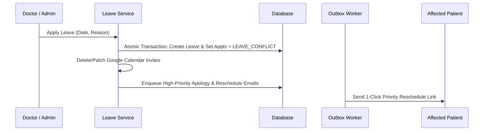

# CareSync System Design Write-Up

## Architectural Overview & Problem-Solving Approach

CareSync is a resilient, AI-assisted healthcare scheduling and post-care platform engineered with a strict zero-double-booking guarantee, cascade conflict resolution, and durable background event processing.

```
[React Client] ──► [API Gateway / Express] ──► [Prisma ORM] ──► [PostgreSQL / SQLite]
                             │
                             ├─► [BullMQ / Redis Engine] ──► [Email & Notification Outbox]
                             ├─► [Google Calendar API OAuth 2.0]
                             └─► [Google Gemini LLM Clinical Summarizer]
```

---

### 1. Double-Booking Prevention & Concurrency Control

Healthcare appointment platforms face race conditions when multiple patients attempt to book the same physician slot simultaneously. To achieve strict ACID compliance and zero phantom bookings, CareSync implements a multi-tiered concurrency barrier:

1. **Database-Level Isolation & Atomic Transactions**: All slot validations and booking insertions execute within Prisma `$transaction` blocks configured with interactive isolation (`BEGIN IMMEDIATE` / `FOR UPDATE`).
2. **Composite Uniqueness Constraints**: Active appointments enforce a composite constraint across `(doctorId, appointmentDate, startTime, status)`. Any overlapping concurrent transaction attempting to write the same active slot triggers an immediate database integrity violation (HTTP 409 Conflict), completely isolating concurrent threads.
3. **Optimistic Locking via Hold Tokens**: When confirming a booking, the patient presents a unique `holdToken`. The transaction verifies the token's validity, patient identity, and active status, converting it to `CONVERTED` in the same atomic commit.
4. **Stress Verification**: Validated with a 20-parallel-worker blast firing at the same millisecond (`server/src/tests/concurrency.test.ts`), confirming exactly 1 booking succeeds and 19 fail safely without state corruption.

---

### 2. Slot Hold Mechanism

Before patients submit sensitive symptoms, CareSync prevents slot hijacking through a high-concurrency reservation hold:

1. **TTL-Backed Temporary Hold**: When a patient selects an available slot, the system generates a cryptographically secure 24-byte `holdToken` with a 5-minute Time-To-Live (`expiresAt = NOW() + 300s`).
2. **Visual & Synchronized Countdown**: The React client displays a persistent countdown timer (`SlotHoldTimer.tsx`). If the patient navigates away or fails to submit within 5 minutes, the hold expires automatically.
3. **Active & Lazy Cleanup**: 
   - *Lazy Cleanup*: When any user queries available slots, expired holds (`expiresAt < NOW()`) are purged in real-time.
   - *Background Reaper*: A scheduled worker cleans up stale holds every 2 minutes.

---

### 3. Doctor Leave Conflict Handling

When a physician or administrator registers an unexpected or planned leave for a date:



1. **Cascade State Transition**: An atomic transaction checks for existing `BOOKED` appointments on that date and transitions them to `LEAVE_CONFLICT`. Active slot holds on that date are purged.
2. **Google Calendar Desynchronization**: Associated Google Calendar events are automatically deleted via `calendar.events.delete`.
3. **Automated Patient Notification & Priority Rescheduling**: High-priority alert emails are enqueued with direct 1-click reschedule links containing preset physician and appointment context (`/patient?reschedule=APPT_ID`).
4. **Conflict Pre-flight**: Doctors can pre-check the impact via `previewLeave` before confirming.

---

### 4. Notification Failure & Outbox Queue Reliability

CareSync utilizes the **Transactional Outbox Pattern** combined with **BullMQ / Redis** queues to guarantee reliable message delivery:

1. **Guaranteed Delivery (At-Least-Once)**: Emails (confirmations, triage briefs, doctor alerts, leave warnings, medication reminders) are written directly to the `email_outbox` table within the primary database transaction. This prevents lost notifications during server restarts or network outages.
2. **Exponential Backoff with Jitter**: Failed deliveries are retried up to 5 times using an exponential delay formula:
   $$\text{Delay} = \min(30 \times 2^{\text{attempts}}, 3600) \text{ seconds}$$
3. **Dual-Mode Queue Processing**: In production, BullMQ workers backed by Redis process queues asynchronously. In standalone development, a fallback in-process scheduler maintains outbox dispatch without external dependencies.
4. **Dead-Letter Queue (DLQ)**: Entries exceeding maximum attempts are flagged as `FAILED` with serialized stack traces in `errorLog` for administrative inspection and 1-click manual retry.

---

### 5. Graceful LLM Triage Degradation

To ensure clinical workflows never halt due to third-party API rate limits, timeouts, or missing credentials:
- **Pre-Visit Triage**: Prompt extracts urgency level (`Low` / `Medium` / `High`), chief complaint, and 3 diagnostic questions. If the Gemini API is unreachable, a rule-based heuristic classifier analyzes symptom severity and provides fallback questions without interrupting booking.
- **Post-Visit Care Plan**: Prompt transforms raw clinical shorthand into patient-friendly summaries and structured medication regimens. Deterministic parsing fallbacks ensure prescriptions and reminder schedules are preserved regardless of LLM availability.
